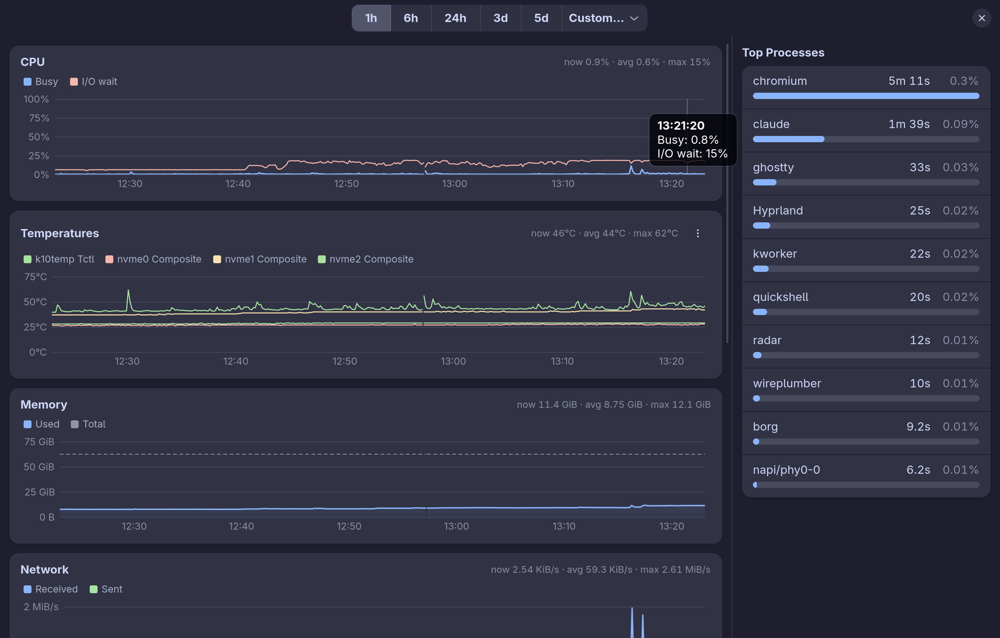

# Radar

See how busy your machine has been, and why.



Radar is a small system activity recorder and viewer for a single-user Linux
desktop. It has two parts:

- **`radar-collect`** samples CPU, temperatures, memory, network, disk and
  per-process CPU time every five seconds into a SQLite database. It runs as
  a systemd user service, reads only `/proc` and `/sys`, and keeps a rolling
  window of five days.
- **`radar`** is a GTK 4 / libadwaita app. Pick a time range and see charts of
  that activity, plus the processes that used the most CPU in that range.

On Omarchy, the app follows the active theme. Elsewhere it uses the Adwaita
look and the desktop's light or dark preference.

## Building

Radar is written in Rust and needs the `gtk4`, `libadwaita` and `sqlite`
libraries plus `pkgconf`. On Arch:

```
sudo pacman -S --needed rust pkgconf gtk4 libadwaita sqlite
```

Then:

```
make install
```

This builds in release mode, installs both binaries to `~/.local/bin`,
installs the desktop file, icon and user service, and starts the collector.
Run `make uninstall` to remove it all again.

## Data

The database lives at `~/.local/share/radar/radar.db`. Run
`radar-collect --help` for the sampling interval and retention flags, and
`radar --help` for the viewer's options.

## License

MIT. See [LICENSE](LICENSE).
